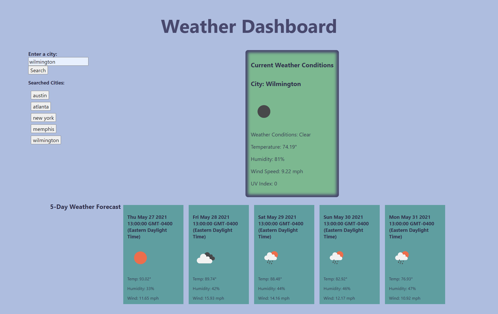

# weather-app
An app that provides you with a weather dashboard for searched cities. 

## Table of contents
- [Deployed Website](#deployedwebsite)
- [Description](#description)
- [Screenshots](#screenshots)
- [Tech/Framework](#tech/framework)
- [Contributions](#contributions)
- [License](#license)

## Deployed Website

 https://jessgreene9.github.io/weather-app/

## Description

This application is a weather dashboard designed to show current conditions as well as a 5 day forecast for the selected city. Using a third party API from OpenWeather, data is retrieved upon each search. Each search is then saved locally and displayed on the screen in a search history as a button that can be clicked to access the weather for that recently selected city. 

Displayed for current conditions are the date, an icon representation of weather conditions, the temperature, the humidity, the wind speed, and the UV index. The 5 day forecast displays the date, an icon representation of weather conditions, the temperature, the wind speed, and the humidity. 

## Screenshots

## Tech/Framework

VS Code

## Contributions

This project was made with help from:

* UNCC BootCamp class
* My tutor, Josh Furlin

## License

